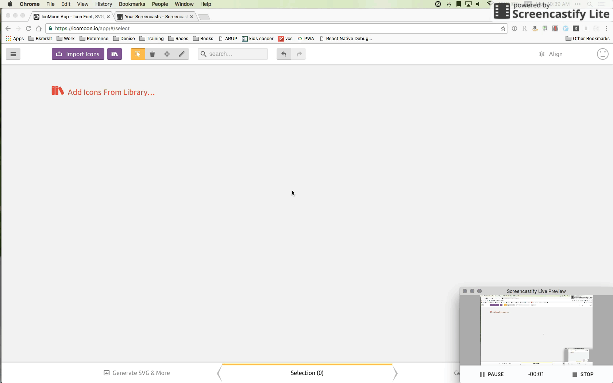
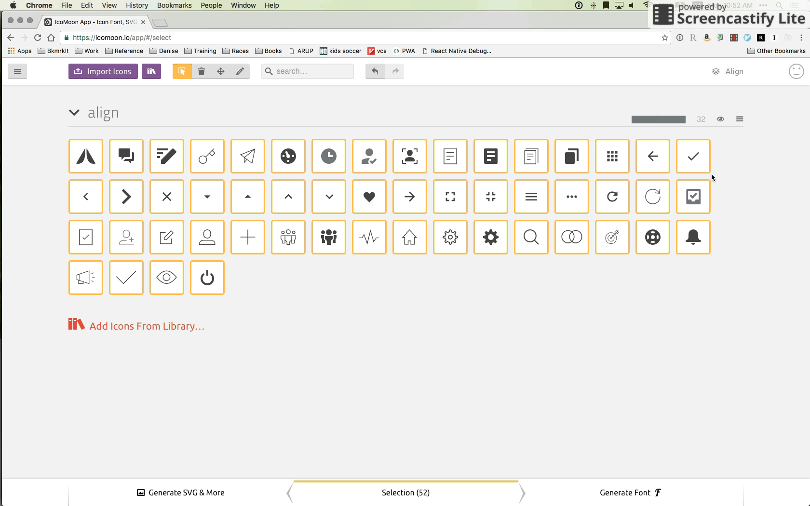
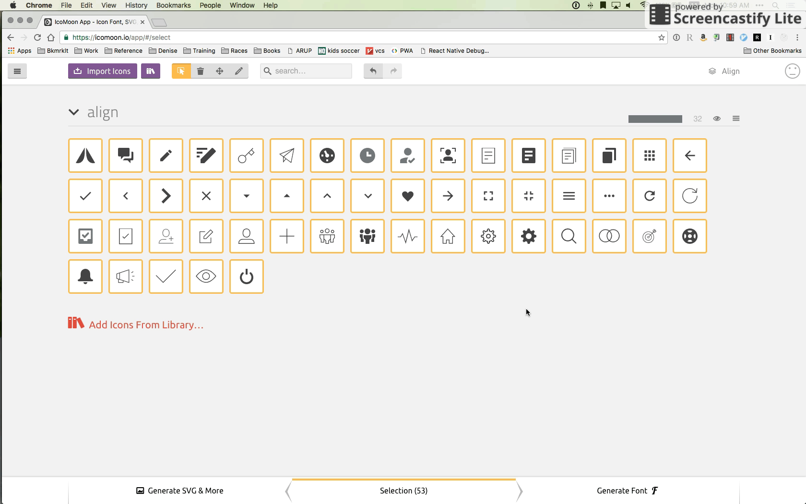

# Prism UI Font

Icon font used in Prism

## Dev

Contributions are welcome and available via the following methods

1. Navigate to https://icomoon.io/app/#/select
2. **ALWAYS** upload `selection.json` by either using the _Import Icons_ button or using projects (Main Menu -> Manage Projects) 
3. Add icons to the font using the font's menu on the far right (Import to Set) 
4. Be sure all icons are selected and click the _Generate Font_ button
5. Download the font 
6. Copy `fonts`, `selection.json`, `style.scss`, and `variables.scss` to this directory.
   1. Don't replace this readme!
7. Remove `url('fonts/prism.ttf') format('ttf')` and `url('fonts/prism.svg') format('svg')` from the `style.scss` file
8. Delete `fonts/prism.ttf` and `fonts/prism.svg`.
9. Rename `styles.scss` to `icon.scss`.
